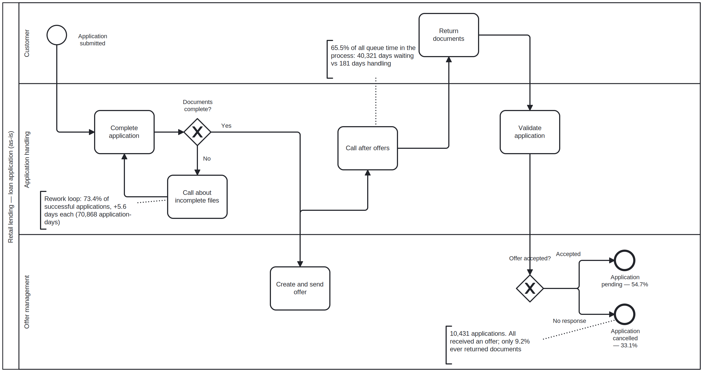

# As-Is Findings — Loan Application Process

*Source: BPI Challenge 2017 event log (Dutch financial institution, Jan 2016 – Feb 2017).
Analysis: `discover2.py`. Supporting output: `/outputs`.*

---

## Summary

The lender converts 54.7% of applications and loses 33.1% to cancellation. Almost
every cancelled application had already received a formal offer, and fewer than one
in ten of them ever returned documents — so the loss occurs after the bank has done
the expensive work, not before. In parallel, the follow-up call made after an offer
is sent holds 65.5% of all queue time in the process, despite taking minutes to
perform. Separately, three-quarters of successful applications pass through a
document-incompleteness loop that adds 5.6 days each.

The engagement is built on the first finding: value lost after offer, and the
under-served follow-up step that sits alongside it.

---

## The as-is process

*Reconstructed from the event log, not from process documentation. Three lanes:
customer, application handling, offer management. The two annotated points are
where value is lost — the document rework loop, and the post-offer follow-up
call. Source model: [`as-is-process.bpmn`](as-is-process.bpmn).*

---

## Method note

The log records up to seven lifecycle transitions per activity instance — schedule,
start, suspend, resume, ate_abort, withdraw, complete. Activity executions are
therefore counted once per `complete` transition. The remaining transitions are not
discarded but repurposed: the gap following a `schedule` event is treated as queue
time, and the gap following a `start` event as processing time.

This matters because a naive count treats each transition as separate work. Under
that reading, 59% of all events in this log appear to be repeats and the busiest
activity appears to be a task with a median delay of thirty-six seconds. Both are
artifacts of log structure rather than facts about the process. The corrected count
puts genuine repeat execution at 14.7%.

Cycle-time comparisons are made within outcome group rather than across the whole
population. Cancelled applications sit dormant far longer than completed ones, so
pooling them reverses the apparent effect of rework — the uncontrolled comparison
suggests rework makes applications faster, which is an artifact of composition, not
a finding.

---

## 1. The process as documented is not the process as run

| Measure | Value |
|---|---|
| Applications | 31,509 |
| Recorded events | 1,202,267 |
| Completed activity instances | 475,306 |
| Distinct activities | 24 |
| Resources (staff) | 149 |
| Period | Jan 2016 – Feb 2017 |
| Distinct path variants | 15,930 |
| Share of cases on the most common path | 3.4% |

There are 15,930 distinct routes through a process handling 31,509 applications —
approximately one unique path for every two cases. No single route accounts for
more than 3.4% of volume, and it takes 9,629 variants to cover 80% of cases.

No organisation designs a process this way. Variation on this scale means either
that staff are routinely working around the documented procedure, or that the
supporting system permits steps to be taken in almost any order and no rule
constrains them. The log cannot distinguish between the two, and the distinction
matters: the first is a compliance and training question, the second is a system
configuration question, and they lead to different remedies.

What can be said from the data is that any process documentation describing a
standard path is describing something that happens to a small minority of
applications. Performance measures built on the assumption of a standard path
should be treated with caution for the same reason.

---

## 2. A third of applications are lost after an offer has been made

| Outcome | Cases | Share | Median cycle time | P90 |
|---|---|---|---|---|
| Pending (offer accepted) | 17,228 | 54.7% | 14.8 days | 32.9 |
| Cancelled | 10,431 | 33.1% | 31.6 days | 38.6 |
| Denied | 3,752 | 11.9% | 14.1 days | 29.6 |
| Open at log boundary | 98 | 0.3% | — | — |

Of the 10,431 cancelled applications:

- **10,431 (100%)** had an offer created
- **959 (9.2%)** ever returned documents
- **955 (9.2%)** entered the incompleteness loop
- **93.3%** show `O_Cancelled` immediately before `A_Cancelled`
- Median time to cancellation: **31.6 days**, roughly double the 14.8 days taken
  by a successful application

The shape of this loss is specific. Every cancelled application had reached the
point where the lender had assessed it, priced it, and issued a formal offer —
the costly part of the process was already complete. What did not happen was the
customer's response: only 9.2% returned documents, meaning more than nine in ten
cancellations are customers who received an offer and then went quiet.

The closure itself is not the problem. In 93.3% of cases the offer is cancelled
and the application closed in the same moment, and the median idle period between
the last substantive activity and closure is zero days. An earlier hypothesis —
that dormant files sat in an administrative backlog — is not supported. The system
closes cleanly once the decision to close is taken.

The loss therefore sits in a defined window: between an offer being sent and the
customer either responding or being written off, a period whose median is 31.6 days.

---

## 3. The follow-up call is the most backlogged task in the process

| Activity | Queue time (days) | Share of all queue | Processing time (days) | Median queue |
|---|---|---|---|---|
| W_Call after offers | 40,321 | 65.5% | 181 | 0.00 h |
| W_Complete application | 20,306 | 33.0% | 138 | 1.37 h |
| W_Handle leads | 881 | 1.4% | 7 | 0.02 h |
| W_Assess potential fraud | 14 | 0.0% | 3 | 0.00 h |

The ratio between the two time columns is the finding. `W_Call after offers`
consumes 40,321 days of queue time against 181 days of actual handling — the work
is trivial, the waiting is not. Two thirds of all queue time in this process
accumulates on a single activity that takes minutes to perform.

That activity is the follow-up made after an offer has been sent: the step whose
purpose is to reach a customer who has received an offer and not yet responded.
It sits directly in the window identified in section 2.

**These two findings coincide; the log does not establish that one causes the
other.** An event log records what happened and when, not why a customer chose
not to respond. It is possible that customers who go quiet are lost regardless of
follow-up, and that the backlog is a symptom of volume rather than a cause of
attrition. Testing the link properly would require either comparing conversion
between applications that did and did not receive a timely call, or interviewing
the staff who make them — neither of which the log alone supports.

What the log does establish is that the intervention designed for exactly this
failure mode is the most under-served activity in the process, and that it is
under-served by a wide margin.

---

## 4. Rework adds 5.6 days to three-quarters of successful applications

| Outcome | Cases | % hitting `A_Incomplete` | Median with | Median without | Difference |
|---|---|---|---|---|---|
| Pending | 17,228 | 73.4% | 16.7 days | 11.1 days | **+5.6 days** |
| Denied | 3,752 | 36.1% | 16.9 days | 13.0 days | +3.9 days |
| Cancelled | 10,431 | 9.2% | 25.9 days | 31.6 days | −5.8 days |

Across successful applications the loop accounts for **70,868 application-days**.

Repeat execution totals 69,668 extra activity instances — 14.7% of all completed
instances, affecting 16,234 cases. The most repeated activity is `A_Validating`
(16,946 repeats across 11,669 cases), followed by offer creation and re-issue.

Nearly three-quarters of applications that ultimately succeed are held up at least
once for incomplete documentation, and validation is performed more than once on
roughly a third of all applications. Two readings are available and they are not
equivalent. Either the validation step is drawing an unreasonable line — asking for
material customers cannot easily supply, or checking in a sequence that surfaces
problems late — or the documents arriving at validation are systematically
incomplete because nothing upstream tells the customer what is required. The first
points to redesigning the check; the second points to changing what is asked of the
customer at submission. Distinguishing them requires knowing *what* was incomplete,
which this log does not record.

The negative figure for cancelled cases is a composition effect, not a finding:
cancelled applications that entered the loop were engaged customers who then
stopped, whereas those that did not enter it typically went quiet immediately after
receiving an offer and were written off later.

---

## What this means for the engagement

Three findings are available. The engagement is built on the second and third
together — value lost after offer, alongside the under-served follow-up step —
because it is the only one of the three expressed in revenue rather than
efficiency, and because it has a defined intervention window of roughly four weeks
in which action is possible.

The rework finding in section 4 is real and quantified, but its remedy depends on
information the log does not contain, and its benefit is cycle-time reduction on
applications that already convert. It is recorded here and carried into the
requirements as a secondary consideration, not pursued as the primary
recommendation.

The variance finding in section 1 is context rather than opportunity. It explains
why performance reporting on this process is unreliable and it justifies process
discovery as an approach, but 15,930 variants is not itself something to fix.

**The question carried into the to-be design:** what would it take to reach a
customer within the window where an offer is still live, and what share of the
10,431 lost applications is realistically recoverable?

---

## Value at stake — and how it must not be stated

The cancelled applications carry a combined requested principal of €166,018,320
(median €11,000). **This figure is not an opportunity and must not be presented as
one.** It is the amount customers asked to borrow, not revenue: a portion of these
applications would have been declined on credit grounds regardless, and the
lender's return on those that completed would be interest margin over the term,
not the principal itself.

Sizing the opportunity properly requires a recovery-rate assumption applied to
cancelled volume, and a net interest margin applied to the recovered lending, with
both stated explicitly. That work belongs in the business case, not here.

---

## Limitations

- `reached_offer_sent` (10,536) exceeds the number of cancelled cases (10,431);
  some applications use both the postal and online send channels.
- 98 cases were still open at the log boundary and are excluded from
  outcome-based comparisons.
- The log records system events only. Customer-side reasons for non-response are
  not observable, so section 3 establishes coincidence, not causation.
- The log does not record *what* documentation was incomplete, limiting root-cause
  analysis of the rework loop.
- Queue and processing time are inferred from lifecycle transitions. Where an
  activity is suspended and resumed, the intervening period is attributed as
  queue time.
