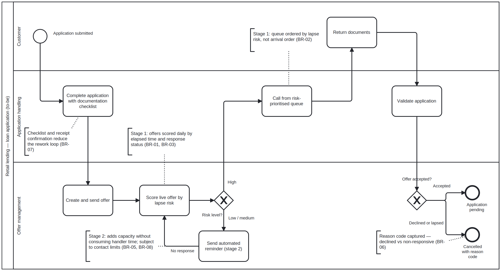

# ConsultLab — Loan Application Process Diagnostic

> A business analysis engagement: reconstructing a real loan application process from system event data, diagnosing where value is lost, and specifying a technology-enabled recommendation with a quantified business case.

**🚧 Status: in development.** Discovery, as-is analysis, process modelling, requirements definition and the to-be design are complete. The business case and recommendation deck are in progress — figures below are produced from the event log; nothing is claimed ahead of the work.

---

## Findings so far

A process diagnostic of **31,509 loan applications** (1.2m events, 149 staff, 13 months), reconstructing the as-is process directly from system event data rather than from documentation.

- **33.1% of applications are cancelled after a formal offer has been issued** — 10,431 cases. Every one had received an offer; fewer than one in ten ever returned documentation.
- **The follow-up call made after an offer is sent holds 65.5% of all queue time** in the process — 40,321 days of waiting against 181 days of actual handling. The intervention designed for this failure mode is the most under-served task in the process.
- **73.4% of successful applications pass through a document-incompleteness loop**, adding 5.6 days each — 70,868 application-days in total.
- **15,930 distinct process variants** across 31,509 applications; no single path accounts for more than 3.4% of cases.

The engagement is built on the first two findings, which coincide in the data. **The event log establishes that they co-occur, not that one causes the other** — that limit is stated explicitly in the findings and shapes how the recommendation is framed.


*The as-is model, reconstructed from the event log rather than from process documentation. The two annotated points are where value is lost.*

📄 **[Read the full as-is findings →](02-as-is/findings.md)** · [BPMN source](02-as-is/as-is-process.bpmn)

---

## Recommendation

**Reprioritise the follow-up queue by lapse risk first, then add automated applicant reminders** — delivered in two stages rather than one.



Stage one establishes offer-stage measurement and reorders the queue by risk of the offer lapsing. It is low cost, low risk, and creates the baseline that does not currently exist. Stage two adds an automated reminder channel that consumes no handler capacity.

The staging is deliberate. The event log shows the follow-up backlog and the cancellation rate co-occurring, but cannot prove one causes the other. Stage one tests that assumption cheaply: if reprioritisation alone moves the cancellation rate, stage two is justified; if it does not, the business has learned something important before investing further.

📄 **[Options assessment and weighted scoring →](04-to-be/options-assessment.md)** · [BPMN source](04-to-be/to-be-process.bpmn)

---

## The Engagement

A retail lending function processes loan applications submitted through an online channel. Leadership can see application volumes and approval rates, but has no visibility into performance after an offer is issued — how long an offer stays live, how many applicants respond, or how many are lost while an offer remains open.

**The question:** where is value being lost, what is causing it, and what should the business change?

Rather than model the process from documentation or assumption, this engagement uses **process mining** to reconstruct what actually happens from the system's own event log — then treats the gap between the documented process and the real one as the finding.

---

## Business Questions

1. What does the loan application process look like in practice, as opposed to how it is documented?
2. Where are applications lost, and at what point in the lifecycle?
3. Does follow-up timing measurably affect conversion?
4. Which intervention — process redesign, targeted automation, or system change — delivers the most benefit for the least disruption?

---

## Data

**BPI Challenge 2017** — a real event log from the loan application process of a Dutch financial institution, covering applications filed through an online system in 2016 and their subsequent events.

4TU.ResearchData · DOI `10.4121/uuid:5f3067df-f10b-45da-b98b-86ae4c7a310b`

The raw log is excluded from this repository (see `.gitignore`) and should be downloaded from the source above.

### Method note

The log records up to seven lifecycle transitions per activity instance. Activity executions are counted once per `complete` transition; the remaining transitions are used to separate queue time from processing time. Cycle-time comparisons are made within outcome group, since cancelled applications behave differently from completed ones and pooling them reverses the apparent effect of rework. `discover.py` is the initial pass; `discover2.py` is the corrected analysis, and the correction is documented in the findings.

---

## Approach

```text
Event log
    ↓
Process discovery (as-is)            ✅
    ↓
Bottleneck & rework analysis         ✅
    ↓
Root-cause analysis                  ✅
    ↓
Requirements definition              ✅
    ↓
Solution options assessment          ✅
    ↓
To-be process                        ✅
    ↓
Business case                        ◐
    ↓
Recommendation
```

---

## Deliverables

| # | Deliverable | Status |
|---|---|---|
| 1 | [Project brief](01-discovery/project-brief.md) | ✅ Complete |
| 2 | [Stakeholder analysis & RACI](01-discovery/stakeholder-analysis.md) | ✅ Complete |
| 3 | [As-is findings](02-as-is/findings.md) | ✅ Complete |
| 4 | [Process mining analysis](discover2.py) · [outputs](outputs/) | ✅ Complete |
| 5 | [As-is process model (BPMN)](02-as-is/as-is-process.png) · [source](02-as-is/as-is-process.bpmn) | ✅ Complete |
| 6 | [Business requirements document](03-requirements/BRD.md) | ✅ Complete |
| 7 | [User stories](03-requirements/user-stories.md) · [traceability matrix](03-requirements/traceability-matrix.md) | ✅ Complete |
| 8 | [To-be process model](04-to-be/to-be-process.png) · [source](04-to-be/to-be-process.bpmn) · [options assessment](04-to-be/options-assessment.md) | ✅ Complete |
| 9 | Business case | 🟨 In progress |
| 10 | Recommendation deck & roadmap | ⬜ Not started |

---

## Repository Structure

```text
consultlab/
├── 01-discovery/        Project brief, stakeholder analysis, RACI
├── 02-as-is/            As-is findings, process model, source metadata
├── 03-requirements/     BRD, user stories, traceability matrix
├── 04-to-be/            To-be BPMN, options assessment, business case
├── 05-deliverables/     Recommendation deck, implementation roadmap
├── outputs/             Analysis output (CSV)
├── data/                Event log (excluded — see source above)
├── discover.py          Initial discovery pass
├── discover2.py         Corrected analysis (lifecycle-aware, outcome-controlled)
└── requirements.txt
```

## Running the Analysis

```bash
pip install -r requirements.txt
python discover2.py
```

---

## Methods & Tools

`Process Mining` · `BPMN` · `Requirements Elicitation` · `Stakeholder Analysis` · `Root-Cause Analysis` · `Options Assessment` · `Business Case Development`

`Python` · `pm4py` · `pandas` · `Power BI`

Requirements are documented in line with **BABOK v3** terminology and structure.

---

## Why This Project

Analytics answers *what is happening*. Business analysis has to go further — establish *why*, specify *what should change*, and make the case for it in terms a business will act on. This engagement is built to demonstrate that full path, and to produce the artifacts a business analyst is actually accountable for: process models, requirements, options assessments and a recommendation.

---

## Author

**Rajkumar Vijayan**
MSc Software Development (International Systems), University of Limerick
[LinkedIn](https://linkedin.com/in/rajkumar-vijayan-0135a8338/) · vijayanrajkumar478@gmail.com

---

*Data source: van Dongen, B.F. (2017). BPI Challenge 2017. 4TU.ResearchData. Used for educational and portfolio purposes.*